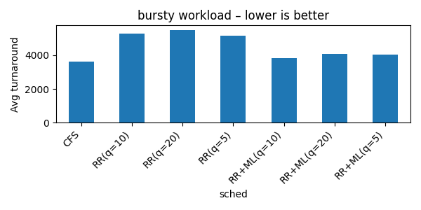
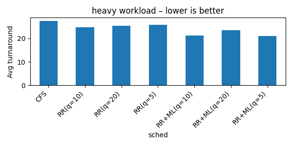
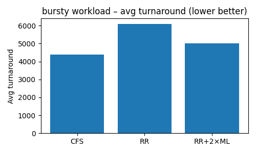
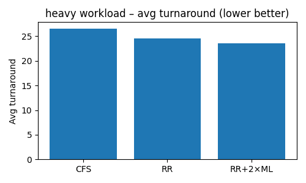

# ML-Augmented CPU Scheduling: RR vs CFS

Following my last post on ML in LRU, I wanted to explore a somewhat novel idea:  
> What if we applied machine learning inside the CPU scheduler?

I built a Python simulation and fed it two classic workloads to test how ML-enhanced Round-Robin scheduling compares to the Linux default, CFS.

---

## Workloads

- **Bursty**: 90% micro-tasks, 10% long scans  
- **Heavy-tail**: thousands of short jobs, a few extremely long ones

---

## Schedulers Compared

| Scheduler           | Description |
|---------------------|-------------|
| **CFS**             | Linux default — picks the task with the least CPU time so far (fair-share), auto-shrinks time slices as the queue grows |
| **Round-Robin (RR)**| First-in, first-out with fixed time slices (tested q = 5, 10, 20) |
| **RR + ML**         | Uses an online classifier to move likely-to-finish tasks to the front of the queue |
| **RR + 2×ML**       | Adds a regressor that predicts task duration and adjusts quantum on the fly (between 2–20 ms) |

---

## Results

### Bursty Workload (Lower is Better)

### Heavy Workload (Lower is Better)

### Bursty Workload — RR vs 2 x ML 

### Heavy Workload — RR vs 2 x ML 

---

## 📌 Takeaways

### Bursty Workload:
- **CFS** had the lowest average and best tail latency — fairness pays off
- **RR + ML** improved turnaround by prioritizing short tasks
- **RR + 2×ML** added too many context switches when mispredicting large scans → performance dropped

### Heavy Workload:
- **RR + ML** shaved off **10–15%** in average turnaround (95% of jobs fit in one slice)
- **RR + 2×ML** added ~3% more improvement, but still suffered on the monster jobs
- **CFS** came third, mainly because it insists on fairness — even for long tasks

---

## 🎓 Final Lessons

- **CFS’s `vruntime` is brilliant** — near SJF performance, yet starvation-proof
- **ML helps when short tasks dominate** (e.g., API gateways, GPU micro-batching)
- **ML-based quantum tuning looks cool on paper**, but often **costs more than it saves**:
  - More context switches
  - More tuning knobs
  - Harder to debug

> Also: Classic Round-Robin doesn’t guard against starvation and is easily exploited.  
> **CFS is extremely well-designed — a solid default.**

