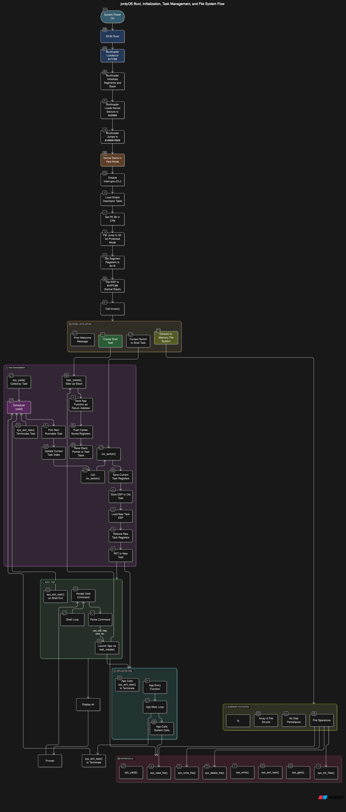

# jordyOS

`jordyOS` is a minimal, bootable operating system featuring a command-line shell, a calculator application, and a text editor with in-memory file support.

It’s written in **x86 Assembly** and **C**, and is built with an i686-elf cross-compiler toolchain.
The OS runs in **16-bit real mode** initially (via the bootloader), then switches to **32-bit protected mode** where it executes a multitasking kernel.

---

## High Level System Design



### System Name: jordyOS

**Type:** 32-bit x86 protected-mode kernel  
**Architecture:** Cooperative multitasking with an in-memory file system

---

### Boot Process

- System powers on and BIOS runs in 16-bit real mode  
- BIOS loads the first 512 bytes (bootloader) into memory at `0x7C00` and jumps there  
- The bootloader:
  - Initializes segments and stack
  - Loads kernel sectors (starting at sector 2) into memory at `0x0800` using BIOS interrupt `13h`
  - Performs a far jump to `0x0000:0800` to start executing the kernel

---

### Protected Mode Setup

- The kernel starts in real mode at `0x0800`
- Disables interrupts (`CLI`)
- Loads the Global Descriptor Table (GDT) with:
  - Entry 0: null
  - Entry 1: 32-bit code segment (selector `0x08`)
  - Entry 2: 32-bit data/stack segment (selector `0x10`)
- Sets the PE (Protection Enable) bit in `CR0`
- Executes a far jump to `0x08:protected_start` to enter full 32-bit mode

---

### Kernel Initialization

- Sets segment registers `DS`, `SS`, etc. to `0x10` (data segment)
- Sets `ESP` to `0x9FC00` (kernel stack)
- Calls `kmain()` (now in 32-bit C)

---

### kmain() Performs

- Initializes in-memory file system (`fs[]`)
- Prints welcome message
- Creates the shell task using `task_create(shell, sh_stack, size)`
- Calls `ctx_switch()` to jump to the shell task

---

### Task Management

- Each task has its own static stack and entry function
- `task_create()` sets up a fake stack:
  - Pushes the app function as the return address
  - Pushes `0`s for `EBP`, `EBX`, `ESI`, `EDI` (callee-saved registers)
  - Saves the stack pointer to `tasks[i].sp`

---

### Context Switching (`ctx_switch.asm`)

- Saves current task’s registers (`push ebp`, `ebx`, `esi`, `edi`)
- Saves `ESP` to the old task’s `sp`
- Loads new task’s `ESP`
- Pops new task’s registers (`pop edi`, `esi`, `ebx`, `ebp`)
- `RET`: jumps into the new task (starts running)

---

### Scheduler (`yield`)

- Round-robin, cooperative scheduler
- Picks next task in `tasks[]` that has a non-`NULL` stack
- If found, updates `cur` index and calls `ctx_switch()`
- Tasks must call `sys_yield()` voluntarily to allow switching

---

### Shell Task

- Displays `sh>` prompt
- Accepts commands like:
  - `calc` → launches calculator app
  - `edit` → launches editor app
  - `help`, `clear`, etc.
- Each app is started using `task_create()` and gets its own stack

---

### App Example: `app_edit()` (Editor)

- CLI-based editor with commands:
  - `new <file>`: creates a file buffer
  - `open <file>`: loads file content from `fs[]`
  - `edit`: enters live typing mode (ESC to exit)
  - `save [file]`: saves buffer to virtual file system
  - `list`: lists all virtual files
  - `delete <file>`: removes file from memory
  - `quit`: exits the task

---

### In-Memory File System

- Uses a global array `fs[]` of file structs:
  - Each file has a name, data buffer, size, and `in_use` flag
- Accessed using system calls:
  - `sys_write_file(filename, buffer, size)`
  - `sys_read_file(filename, buffer, max_size)`
  - `sys_delete_file(filename)`
  - `sys_list_files(output_buffer, max_len)`
- No disk persistence — files are stored only in RAM

---

### System Calls Summary

- `sys_write(str)`: prints to screen
- `sys_getc()`: reads one key
- `sys_yield()`: triggers task switch
- `sys_exit_task()`: terminates current task
- `sys_read_file()`, `sys_write_file()`, etc.: access virtual file system

---

### Memory Model

- Flat 32-bit addressing
- No paging or virtual memory yet
- Each task has a separate stack
- Code and data are shared globally (no user/kernel separation)

---


## Features

-   **Bootloader (`bootloader.asm`)**:
    * Sets up the system from a 16-bit real mode environment.
    * Loads the kernel into memory.
    * Transitions the CPU to 32-bit protected mode.
-   **Kernel (`kernel.c`, `kernel_entry.asm`, `ctx_switch.asm`)**:
    * **VGA Text Mode Output**: Displays text on the screen.
    * **Polling Keyboard Input**: Reads keystrokes via I/O ports.
    * **Cooperative Multitasking**: A simple scheduler allows multiple tasks (applications) to run.
    * **System Calls**: Provides an API for:
        * Console I/O (`sys_write`, `sys_getc`).
        * Task management (`sys_yield`, `sys_exit_task`).
        * Screen manipulation (`sys_clear_screen`).
        * In-memory file operations (`sys_list_files`, `sys_read_file`, `sys_write_file`, `sys_delete_file`).
-   **Shell (`sh>`)**:
    * Provides a command-line interface after booting.
    * Parses user input to launch applications or execute built-in commands.
    * **Built-in commands**:
        * `calc`: Launches the calculator application.
        * `edit`: Launches the text editor application.
        * `clear` (or `cls`): Clears the terminal screen.
        * `help`: Displays available shell commands.
-   **Applications**:
    * **`app_calc` (Calculator)**:
        * Interactive command-line interface (`calc>`).
        * Performs basic arithmetic operations: `add`, `sub`, `mul`, `div`.
        * Supports an `exit` or `quit` command to return to the main shell.
    * **`app_edit` (Text Editor)**:
        * Command-driven interface (`edit#` or `edit [filename]#`).
        * **In-Memory File System**:
            * `new <filename>`: Create a new text file in memory.
            * `open <filename>`: Load an existing in-memory file.
            * `save [filename]`: Save the current text buffer to an in-memory file.
            * `list`: List all in-memory files.
            * `delete <filename>`: Remove an in-memory file.
        * **Text Input Mode**: Entered via the `edit` command (within `app_edit`) to add or modify text. Exit with `ESC`.
        * `quit`: Exits the editor and returns to the main shell.

---

## Example Usage

```txt
jordyOS multitask w/ In-Memory FS 

sh> help
Available commands:
  calc    - Run the calculator app
  edit    - Run the text editor app
  clear   - Clear the screen
  help    - Show this help message

sh> calc
Calculator App. Type 'exit' or 'quit' to close.
calc> add 10 5
15
calc> mul 3 7
21
calc> exit
Exiting calculator...

sh> edit
Editor v0.4 (In-Memory FS)
Commands: list, new <fn>, open <fn>, edit, save [fn], delete <fn>, quit
edit# new myfile.txt
New file 'myfile.txt' in buffer. Use 'edit', then 'save'.
edit [myfile.txt]# edit
--- Text Edit Mode (Press ESC to finish) ---
Hello world!
This is a test file.
--- Exiting Text Edit Mode ---
edit [myfile.txt]# save
File 'myfile.txt' saved (36 bytes).
edit [myfile.txt]# list
Files:
myfile.txt
edit [myfile.txt]# quit
Exiting editor...

sh> clear
```
### Install Toolchain (if not already)

```
$ brew install cdrkit
$ brew install cdrtools
$ brew install i686-elf-binutils i686-elf-gcc
$ brew install nasm qemu
```

### Build and Run the OS

```
$ make
$ make run
```
