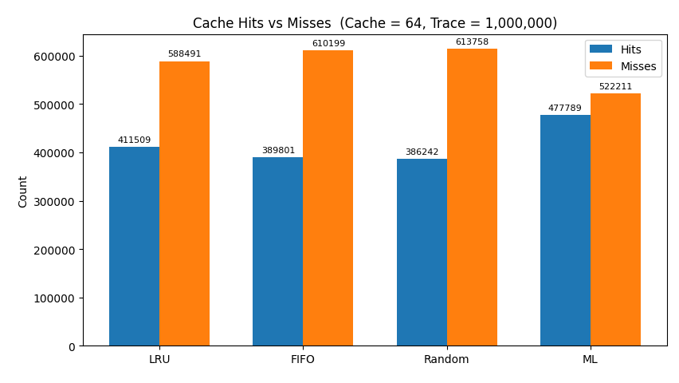
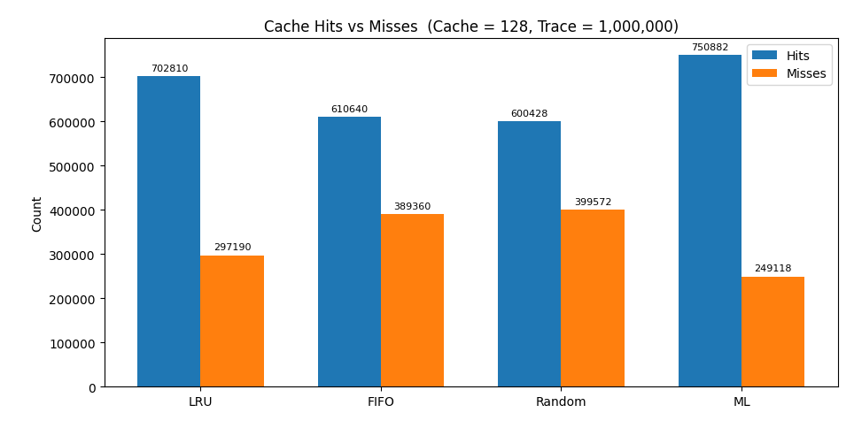
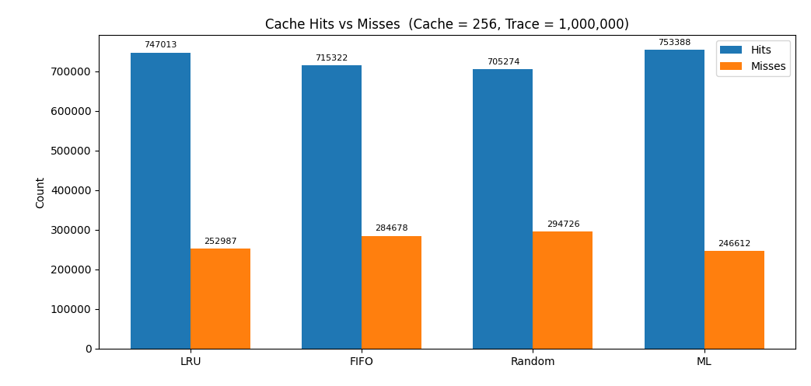
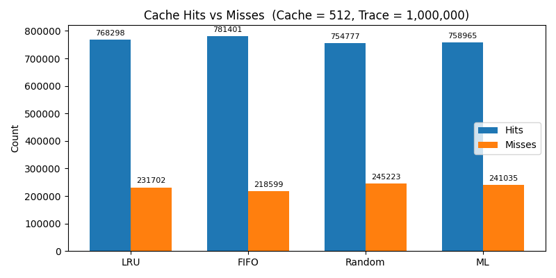
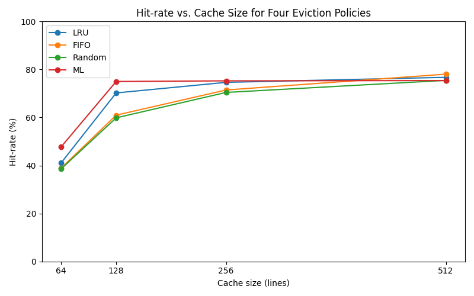

# ML-Augmented LRU vs Traditional Page Replacement Strategies

**While working with virtual memory systems, I began to wonder:**  
> Could a lightweight machine learning model actually out-evict traditional strategies like LRU?

With the rise of ML, it seemed natural to explore smarter page eviction based on historical access patterns. This simulation compares four classic cache replacement policies:

---

## Policies Tested

- **LRU** – Least Recently Used (standard OS heuristic)
- **FIFO** – First-In, First-Out
- **Random** – Random eviction
- **ML** – A logistic regression model predicting whether a page will be reused soon, based on:
  - Long-term frequency
  - Recent recency

---

## Simulation Setup

- **Trace size**: 1,000,000 memory accesses
- **Cache sizes**: 64, 128, 256, 512 entries
- **Metric**: Total number of cache hits and misses

---

## Results

### Cache Size: 64

### Cache Size: 128

### Cache Size: 256

### Cache Size: 512

### Hit Rate Comparison

---

## Key Observations

- At **tight cache sizes**, ML **outperformed LRU** (e.g., 48% vs 41% hit rate at size 64)
- As cache size increased, the gap **narrowed or reversed**
- With **generous cache sizes**, traditional policies like FIFO and even Random began to edge out ML

---

## Takeaways (from an OS Perspective)

- For **general-purpose page caches**, ML does not offer consistent enough gains to justify the:
  - Complexity
  - Latency risks
  - Maintenance cost
- ML strategies **work best in constrained environments** with:
  - Predictable access patterns
  - Tight cache budgets
- In **specialized layers** (e.g., CDN edges, VM hypervisors, database page buffers), the tradeoffs are already practical — and **production ML-augmented policies do exist**

---

## Limitations

- This experiment used **synthetic workloads** and **offline-trained models**
- The trace was **intentionally harsh** (low reuse rate)
- In more dynamic real-world systems, **model drift** could cause ML predictions to hurt performance

---

## Final Thought

> A model trained on yesterday’s access pattern can become obsolete the moment the user opens a different app.  
> Without a dominant reuse pattern, ML rarely beats a robust LRU.

